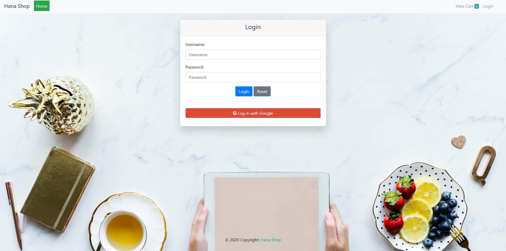

<h1 align="center">Hana Shop - Fastfood Web Application</h1>

## Description 
- A java web app that allows users to order fast food and helps admin to manage the list of foods and drinks in the system.

## Technicals
- Java Web Application
- Java Servlet and JSP service
- Apache Tomcat 8.0.27.0
- Netbean IDE 8.2 RC
- SQL Server
- Google email login integration (Login by Gmail)
- PayPal integration

---

# Demo

## **Home page**

  

## **Cart page**

  

## **Login page**

  

***

✨ *Thank you for visiting* ✨
